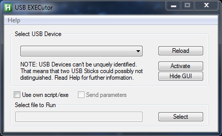

# What can this Tool do?
This tool detects a device change (e.g USB stick got attached, USB stick got pulled out)

If a device change has occured, then it will check if your selected device got attached
to the system. If so, it will execute your script/exe (Or the inbuild HelloWorld script if you
haven't selected anything).

It won't execute your script again until you restart your script or disconnect your device
from the system and reattach.

Please Note: 

1.  The current implementation requires between each reattach at least 5 sec.

2.  USB Sticks have no unquie identifier, so two USB sticks from the same production line,
    has the same "devicePath"(identifier). If two of the same USB sticks got attached
    the deviePath got suffixed with "&1". Therefore the one stands for the first attached
    usb device 2 for the second and so on.

# How to use?
Select your device, chose script/exe to execute, press activate. 

# Can you use it without GUI?
You can configure this tool with the config completely without GUI, so you
can run it in the background. (state_active, state_hidden and state_hidden_taskbar to 1)

# Can you send the drive letters to the script/exe?
Yes, please tick the "Send parameter" checkbox. They will be attached at the end of the
edit line (not visible). E. g. "G:,H:" see "example1.ahk" how to use.